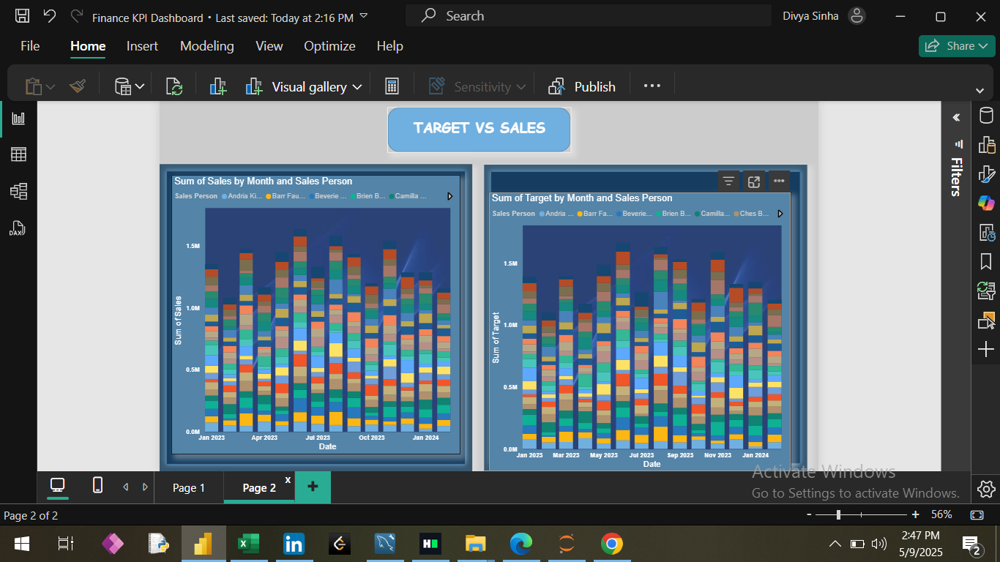

# Finance-KPI-Dashboard

An interactive Power BI dashboard that visualizes key financial KPIs by comparing actual sales to targets. This project helps in tracking performance, identifying gaps, and supporting strategic decision-making using clean visual storytelling.

---

## Dashboard Previews

### Finance KPI Dashboard

### Actual vs Target Dashboard

---

## Project Structure

### Datasets Used

1. *Actual Dataset*
   - Sales Person
   - Sales
   - Month
   - Day Name
   - Date

2. *Target Dataset*
   - Sales Person
   - Target
   - Month
   - Day Name
   - Date
   - Year

3. *Calendar Dataset*
   - Date
   - Month
   - Year
   - Days

4. *DimPeople Dataset*
   - Sales Person
   - Team
   - Picture

---

## Dashboard Tabs

### 1. Financial KPI Dashboard

- *Cards displaying*:
  - Total Sales (Actual)
  - Total Sales (Target)
  - Variance
  - Variance Percentage
  - YTD Sales (Actual)

- *Clustered Column Chart*:
  - Actual vs. Target by Year, Quarter, Month, and Day

- *Slicers*:
  - Year, Month, Sales Person

---

### 2. Target vs Sales

- *Clustered Column Chart*: Sum of Sales by Month and Sales Person
- *Clustered Column Chart*: Sum of Target by Month and Sales Person

---

## Features

- KPI tracking and variance analysis
- Year-to-date (YTD) performance monitoring
- Salesperson- and team-level performance insights
- Interactive filtering via slicers
- Clean, clear data storytelling visuals

---

## Technologies Used

- Power BI
- Excel / CSV Files
- DAX (for measures like variance, % variance, YTD)

---

## Getting Started

1. Clone the repository or download the .pbix file.
2. Load the four datasets into Power BI.
3. Create relationships:
   - Date column → Calendar table
   - Sales Person → DimPeople table
4. Build the visuals and add DAX measures as needed.
5. Explore the interactive dashboard.

---

## Author

*Divya Sinha*  
Aspiring Data Analyst | Skilled in Power BI, Python, SQL, and Excel  
Passionate about clean visual storytelling in analytics

---
